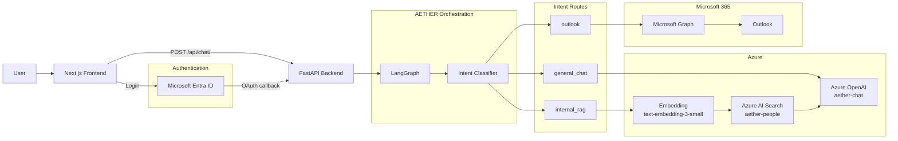
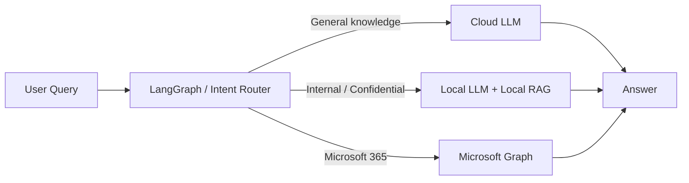

# AETHER Corporate 構成図（Mermaid）

以下は、2026年10月時点の **AETHER Corporate 秋フェーズ** の構成です。

- `general_chat`：Azure OpenAI
- `internal_rag`：Azure AI Search + Azure OpenAI
- `outlook`：Microsoft Graph
- オーケストレーション：LangGraph
- 認証：Microsoft Entra ID
- Frontend：Next.js
- Backend：FastAPI

> 現時点では Local LLM / Local RAG / Jev は未導入です。
> `internal_rag` は検証用データを用いた Azure AI Search ベースのRAGとして動作確認済みです。

## ルートごとの役割

| Route | 用途 | Provider | Retriever | Generator |
|---|---|---|---|---|
| `general_chat` | 一般知識・プログラミングなど | Azure | `none` | `aether-chat` |
| `internal_rag` | 組織内の検証用ナレッジ検索 | Azure | `azure_ai_search` | `aether-chat` |
| `outlook` | Outlookメール取得 | Microsoft | `microsoft_graph` | `none` |

## 将来構想

将来的には、機密性の高い社内情報を Local 側へ寄せる構成を想定しています。

