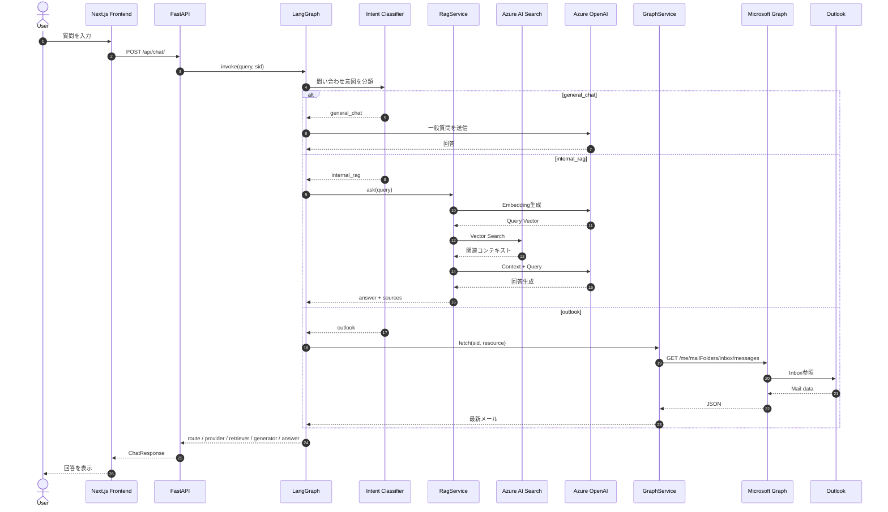
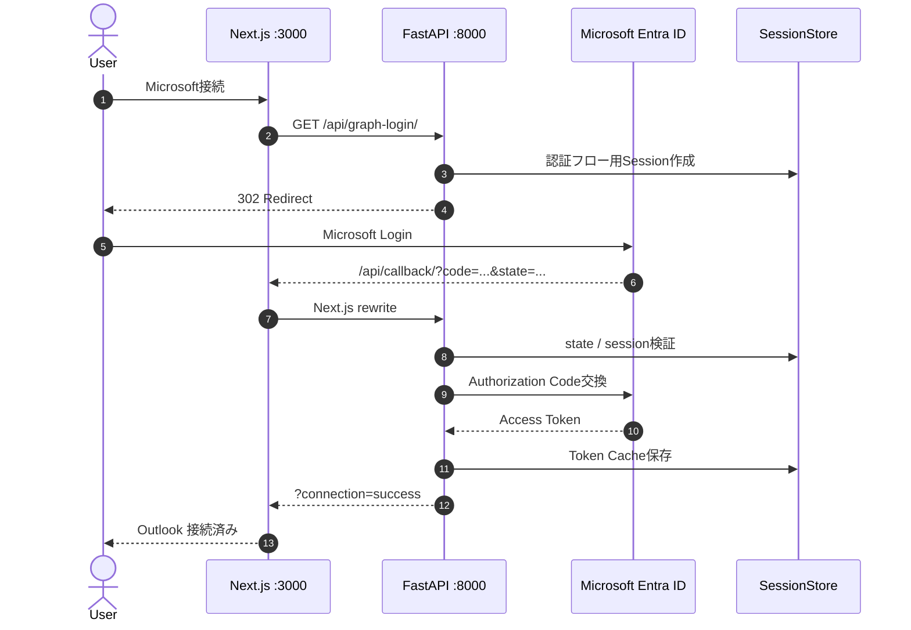

# AETHER Corporate シーケンス図（Mermaid）

以下は AETHER Corporate のチャット処理を、`general_chat` / `internal_rag` / `outlook` の3ルートに分けて表現したシーケンス図です。



## Microsoftログイン時の認証シーケンス



## Outlook取得の実リクエスト

```text
GET https://graph.microsoft.com/v1.0/me/mailFolders/inbox/messages
    ?$top=5
    &$select=subject,from,receivedDateTime,bodyPreview
    &$orderby=receivedDateTime desc
```

取得項目：

- `subject`
- `from`
- `receivedDateTime`
- `bodyPreview`
