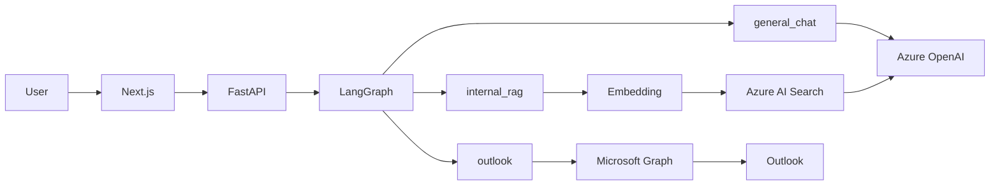

# AETHER Corporate

> AI orchestration platform powered by LangGraph.

AETHER Corporate is a prototype AI platform that routes user requests
to different services depending on their intent.

## Status

**v0.1.0-demo**

Current implementation supports:

- General chat with Azure OpenAI
- RAG with Azure AI Search
- Outlook integration with Microsoft Graph
- Microsoft Entra ID authentication
- Intent-based routing with LangGraph
- Next.js frontend
- FastAPI backend

## Architecture



## Routing

| Route | Purpose | Backend |
| --- | --- | --- |
| `general_chat` | General questions | Azure OpenAI |
| `internal_rag` | Internal knowledge retrieval | Azure AI Search + Azure OpenAI |
| `outlook` | Outlook mail retrieval | Microsoft Graph |

## Example

### General chat

```text
RAGとは何ですか？
→ general_chat
```

### Internal RAG

```text
社内でRAGに詳しい人を教えて
→ internal_rag
```

### Outlook

```text
最近届いたOutlookメールを確認して
→ outlook
```

## Current limitations

- Internal RAG currently uses demo/test data
- Local LLM is not implemented yet
- Local RAG is not implemented yet
- Jev integration is planned for a future release

## Roadmap

```text
v0.1
Cloud orchestration
Azure OpenAI / Azure AI Search / Microsoft Graph

      ↓

v0.2
Local LLM / Local RAG

      ↓

v1.0
Jev × LangGraph × Local / Cloud orchestration
```